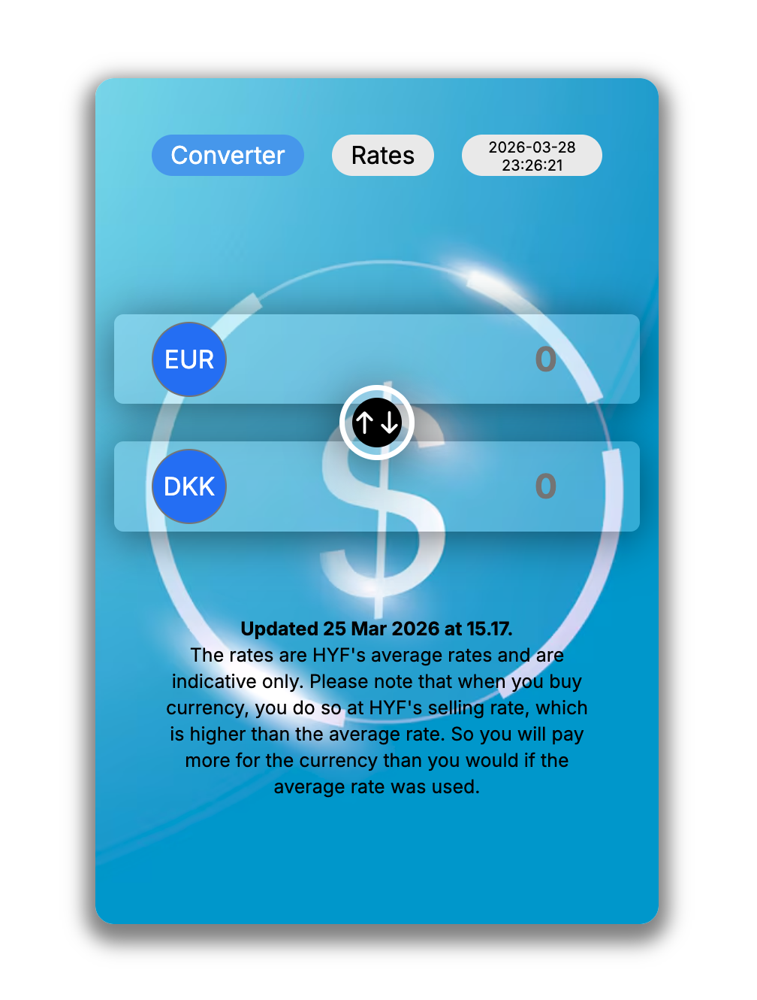
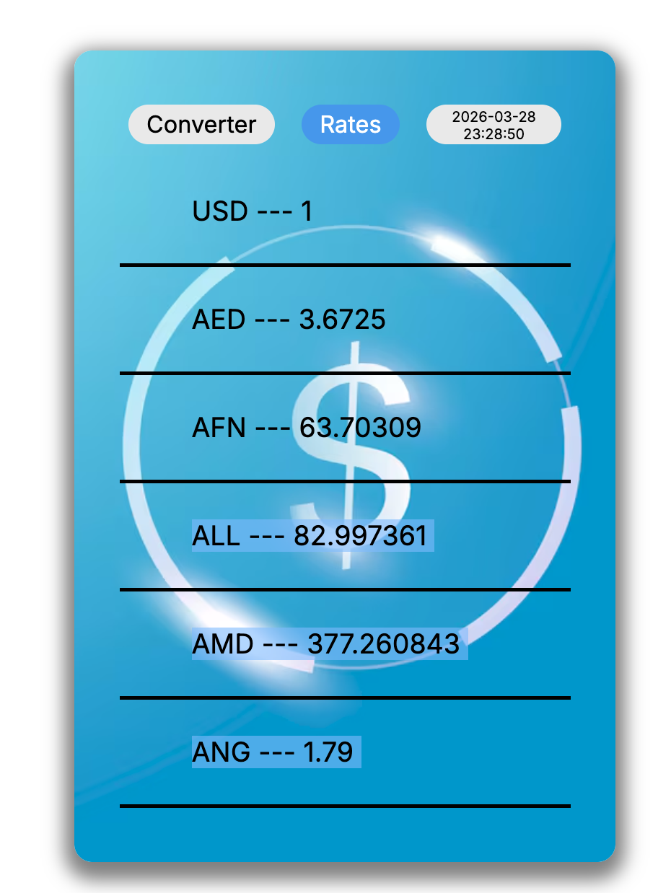

# Currency Converter App

This is a **Currency Converter** mini app inspired by the currency section of **Dansk Bank**, designed for a clean and modern user interface. The app includes **two main pages**:

1. **Conversion Page**
   
   - Quickly convert currencies
   - Automatically updates when the amount or selected currency changes
   - Modern design with glass effect

2. **Rates Page**

   
   - Displays average currency rates

---

## Features

- Real-time currency conversion
- Automatic updates when amount, currency from, or currency to changes
- **Timer showing current date and time** for checking rates in real-time

---

## Technologies

- **HTML / CSS / JavaScript**
- Fetch API for retrieving latest currency rates
- Modern UI design with glass effect

---

## Usage

1. Open the **Conversion Page** to convert currencies. Enter an amount and select currencies; the converted amount updates automatically.
2. Go to the **Rates Page** to see average currency rates.
3. **Timer** displays the current date and time for checking rates in real-time.
