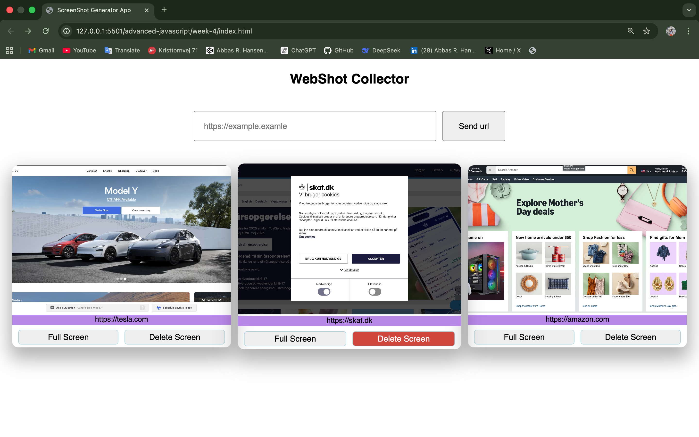
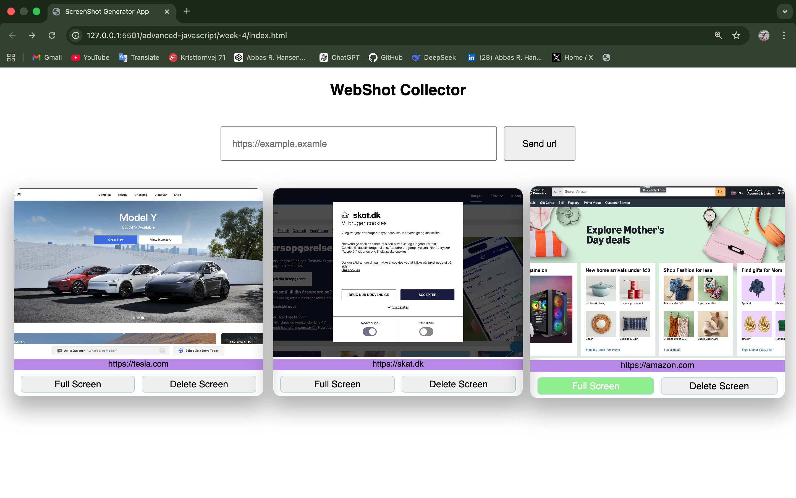

# Webshot Collector

A simple web app to capture website screenshots and manage them easily.

## Features

- Capture screenshots from any URL
- Save screenshots to storage (CRUD API)
- View screenshots in a list
- Open screenshots in full screen
- Delete screenshots

## Usage

1. Enter a valid URL (must start with http/https)
2. Click **Send**
3. Screenshot will appear in the list
4. Use buttons to view or delete

## Screenshots

### Main UI

### Screenshot List

## Tech

- JavaScript
- RapidAPI
- CrudCrudAPI
- Fetch API

## Notes

- API keys must be added in `api.js`
- Some CRUD services (like temporary ones) may expire
